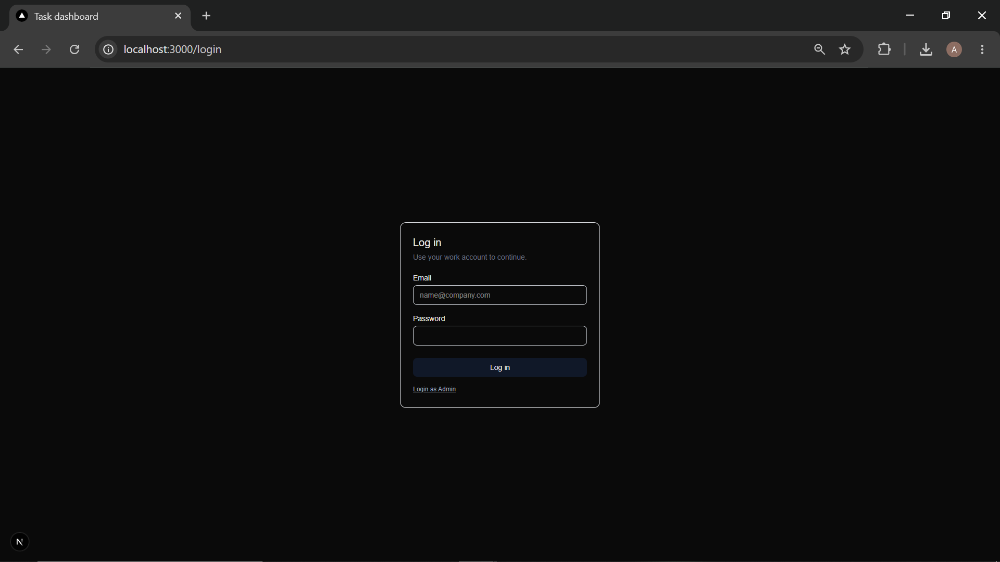
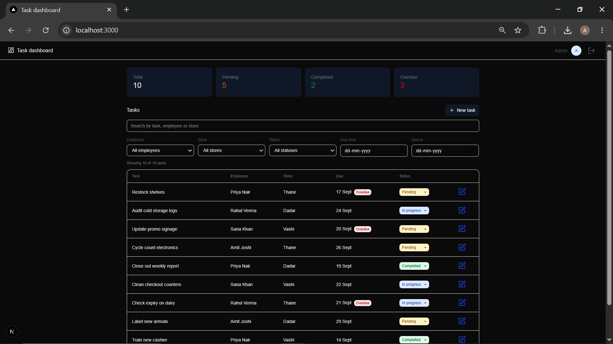
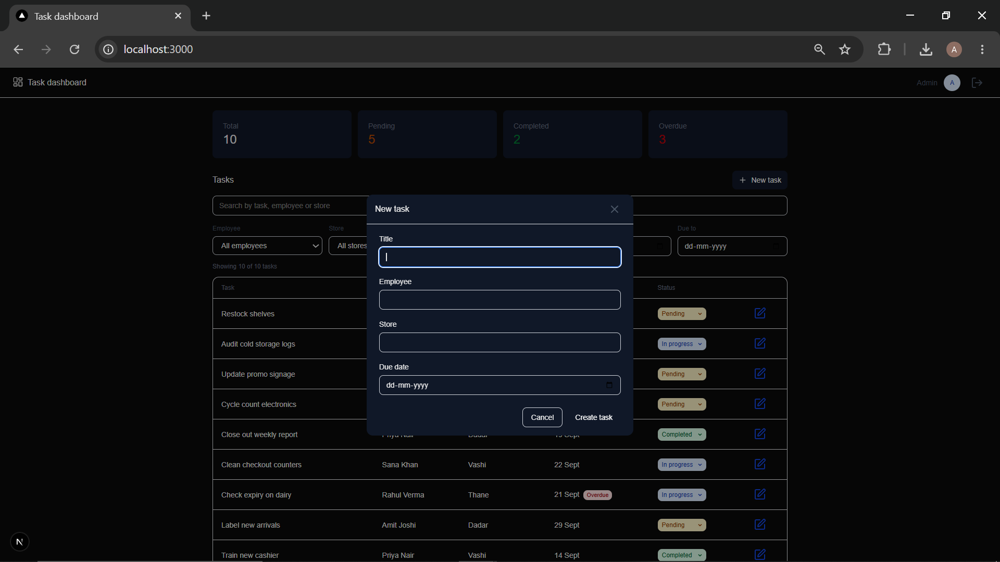

# Task Management Dashboard

A simple Task Management Dashboard to create, organize, track, and manage tasks efficiently.

## Features

* Simple login using a mock API
* Display tasks in a responsive table
* Search tasks
* Filter by:
  * Employee
  * Date
  * Status
  * Store
* Create new tasks
* Edit existing tasks
* Change task status
* Summary cards:
  * Total
  * Pending
  * Completed
  * Overdue
* API error handling
* Form validation
* Responsive design for desktop and mobile

## Tech Stack

* **Next.js**
* **TypeScript**
* **React**
* **Mock API**
* **Tailwind CSS**

## Getting Started

### 1. Clone the repository

```bash
git clone <repository-url>
cd <project-folder>
```

### 2. Install dependencies

```bash
npm install
```

### 3. Start the development server

```bash
npm run dev
```

Open the application in your browser at:

```text
http://localhost:3000
```

## Task Management Flow

```text
Login
  ↓
Task Dashboard
  ↓
View Tasks
  ↓
Search / Filter
  ↓
Create / Edit Task
  ↓
Change Status
  ↓
Dashboard Summary Updated
```

## Task Status

The dashboard supports task status tracking, including:

* Pending
* Completed
* Overdue

The summary cards provide an overview of the current task status:

```text
Total | Pending | Completed | Overdue
```

## Screenshots

### Login



### Dashboard



### Create Task


## Development

Install the dependencies:
```bash
npm install
```

Run the development server:

```bash
npm run dev
```